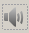

# List of E4CoderGUi widgets

## Button

### Behaviour
Maybe darken background while being pressed.

### Properties
    - name
    - position
    - size
    - outputPort
    - text

## Button Image

### Behaviour
When not pressed draw `releasedImage`, instead, while it is being pressed,
draws `pressedImage`.

### Properties
    - name
    - position
    - size
    - outputPort
    - pressedImagePath
    - releasedImagePath
    
## Button Knob

### Behaviour
Like button image but it can also be rotated.

### Properties
    - name
    - position
    - size
    - outputPort
    - rotationOutputPort
    - pressedImagePath
    - releasedImagePath

## Button LED

### Behaviour
Like button image but it also has a binary state that can be set by the running
application.

### Properties
    - name
    - position
    - size
    - inputPort
    - outputPort
    - initialState
    - inactivePressedImagePath
    - inactiveReleasedImagePath
    - activePressedImagePath
    - activeReleasedImagePath

## Buzzer (?)

### Behaviour
An image that shows when a sound is being played.

### Properties
    - name
    - position
    - size
    - inputFrequencyPort
    - playingImagePath
    - mutedImagePath

## Color Bar

### Behaviour
A bar that shows the progress / capacity / dunno.

### Properties
    - name
    - position
    - size
    - inputPort
    - minimum
    - maximum
    - value
    - orientation (one of BottomToTop, TopToBottom, LeftToRight, RightToLeft)
    - fillColor
    - backgroundColor
    - textOption (one of Percentage, Absolute, NoText)
    - textFont
    - textColor

## Image

### Behaviour
An image that has two states.

### Properties
    - name
    - position
    - size
    - inputPort
    - activeImagePath
    - inactiveImagePath
    - initialState

## Link (?)

### Behaviour
A text with an url associated...

### Properties
    - name
    - position
    - size
    - text
    - url
    
## Needle

### Behaviour
A rotating needle.

### Properties
    - name
    - position
    - size
    - inputPort
    - needleImagePath
    - elementPivotPoint
    - initialValue
    
## Plot

### Behaviour
A plot that shows the change in time of a variable.

### Properties
    - name
    - position
    - size
    - inputPort
    - lineColor
    - scrollWindow
    - yScaleType (one of Manual and Auto)
    - yMinimum
    - yMaximum

## Plotter 2D

### Behaviour
A canvas where something can be drawn. A marker shows the current head position.

### Properties
    - name
    - position
    - size
    - xInputPort
    - yInputPort
    - initialX
    - initialY
    - markerImagePath
    - backgroundColor
    
## Rectangle

### Behaviour
Just a rectangle but it has two states.

### Properties
    - name
    - position
    - size
    - inputPort
    - activeColor
    - inactiveColor
    - initialState
    
## Roller

### Behaviour
A rotating disc where the rotation axis is parallel to the screen.

### Properties
    - name
    - position
    - size
    - outputPort
    - vertical (true/false)
    - minimum
    - maximum
    - value

## Slider

### Behaviour
It can be moved horizontally or vertically.

### Properties
    - name
    - position
    - size
    - outputPort
    - vertical (true/false)
    - minimum
    - maximum
    - value

## SpinBox

### Behaviour
A text widget with two small buttons that shows a number that can be increased 
or decreased using the buttons.

### Properties
    - name
    - position
    - size
    - outputPort
    - vertical (true/false)
    - minimum
    - maximum
    - value
    - font
    - textColor
    - backgroundColor

## Switch

### Behaviour
Like a button image but the drawn image is changed on every touch not just while
being pressed. We could also make it change state when dragged instead of just 
touched.

### Properties
    - name
    - position
    - size
    - outputPort
    - onImagePath
    - offImagePath

## Text Label

### Behaviour
A text.

### Properties
    - name
    - position
    - size
    - inputPort
    - font
    - textColor
    - backgroundColor
    - initialText
    - horizontalAlignment (one of Left, Right, HCenter, Justify)
    - vertical Alignment (one of Top, Bottom, VCenter)

## Tracker 2D

### Behaviour
Like the plotter but shows the user input.

### Properties
    - name
    - position
    - size
    - xOutputPort
    - yOutputPort
    - initialX
    - initialY
    - markerImagePath
    - backgroundColor
    